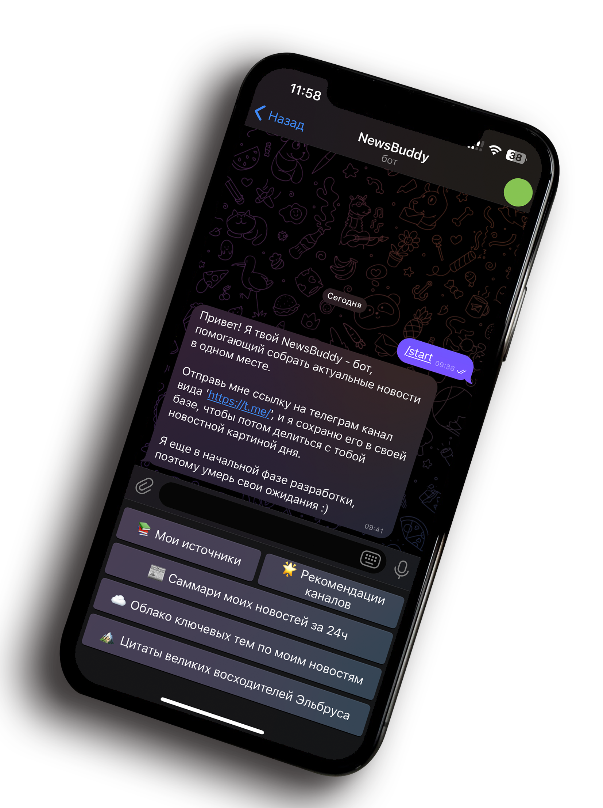
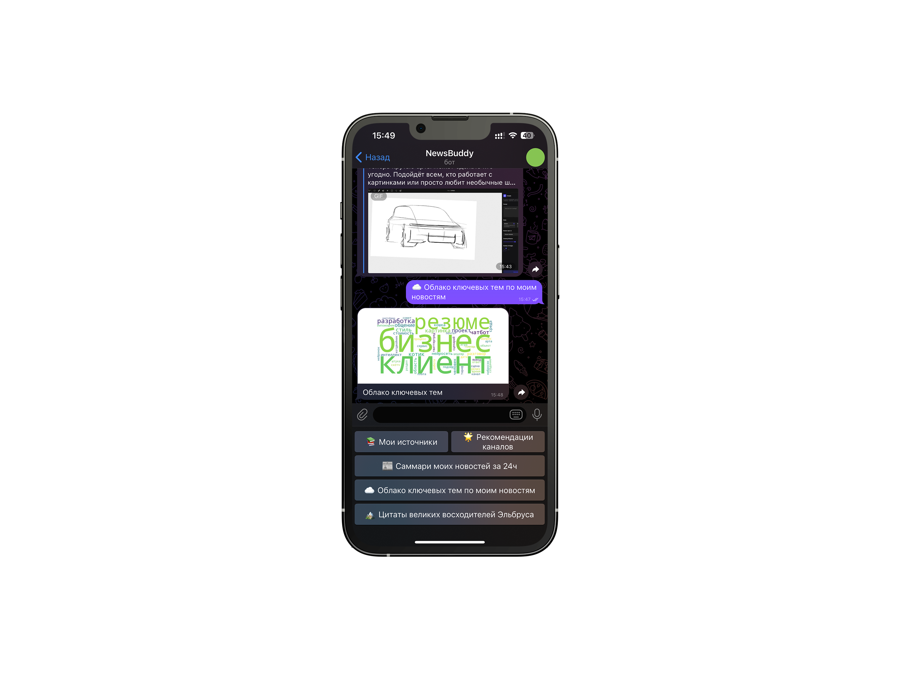
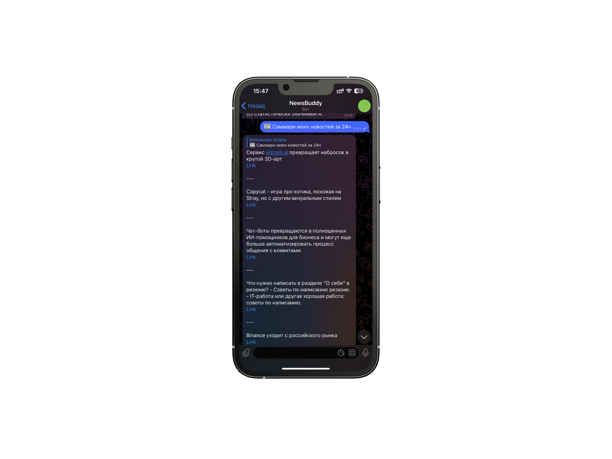
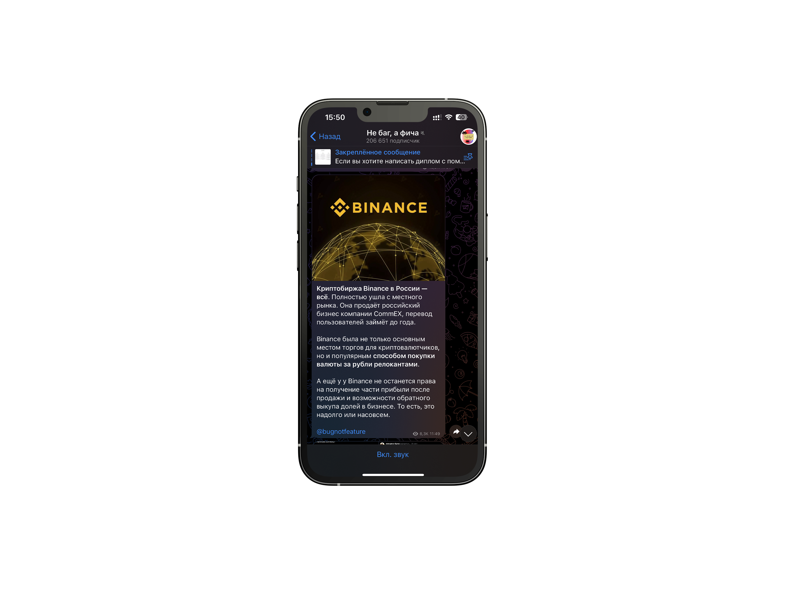
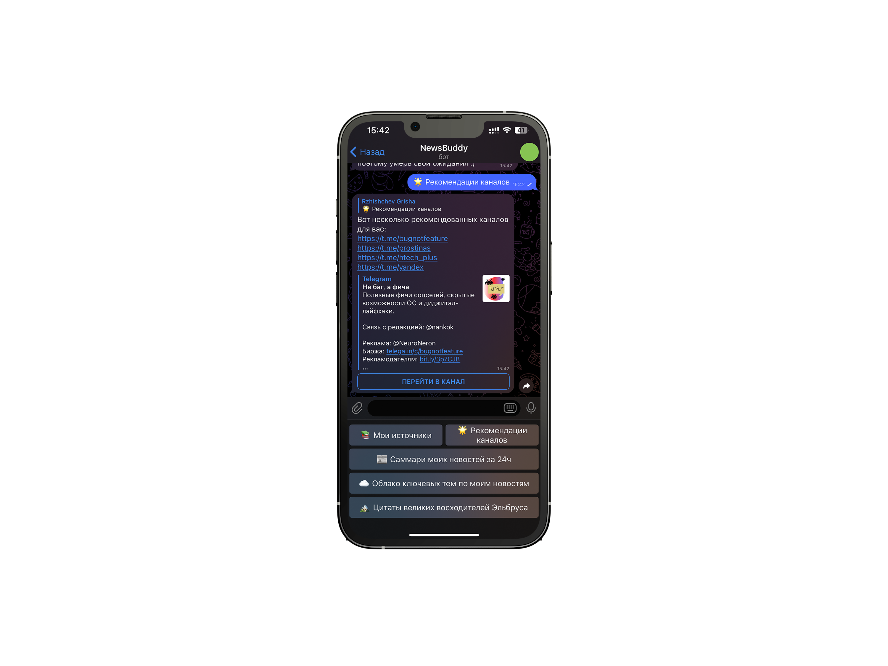

# Стек


# NewsBuddy
**NewsBuddy** - это бот, который помогает вам быть в курсе последних новостей из ваших любимых телеграмм-каналов.    

Он собирает новости с тех каналов, на которые вы подписаны, и дает вам краткое изложение за день. Вы можете прочитать саммари, чтобы узнать, что происходит в мире, или перейти к полным статьям, если вас заинтересовало что-то конкретное. 

Также NewsBuddy может создавать облако слов из новостей, чтобы показать вам, какие темы и ключевые слова были наиболее популярны в течение дня. Это может помочь вам отслеживать тренды и находить новые интересные источники информации. 
Кроме того, NewsBuddy может рекомендовать вам каналы в зависимости от ваших предпочтений и интересов. NewsBuddy - это ваш личный помощник по новостям, который делает чтение новостей удобным и интересным.
<p align="center">
  
</p>

# Команда проекта
1. [Владимир Кадников](https://github.com/vkadnikov92)
2. [Григорий Ржищев](https://github.com/Rzhischev)
3. [Владислав Филиппов](https://github.com/Vlad1slawoo)
   
# Библиотеки
```typescript
import os
import io
import csv
import time
import json
import random
import asyncio
from aiogram import Bot, Dispatcher, types
from telethon import TelegramClient
from datetime import datetime, timedelta
from aiogram.types import BufferedInputFile
```
# Установка 
1. Перейдите в директорию в которой хотите хранить репозиторий с ботом
2. Клониройте репозиторий на ваш пк(git clone git@github.com:vkadnikov92/NewsBuddy.git)
# Запуск 
1. Перейдите на [сайт](https://my.telegram.org/auth) и создайте свое приложение, оно понадобится для работы бота
2. Создайте своего бота в BotFather telegram 
3. Перейдите в директорию с ботом и активируйте свое виртуальное окружение для данного проекта
4. Установите необходимые библиотеки из requirements.txt(pip install -r requirements.txt)
5. Заполните необхходимые поля(api_id api_hash phone и API_TOKEN) в файле bot.py (данные должны быть у вас после 1 и 2 шагов)
6. После заполнения необходимых переменных просто запустите bot.py и пройдите аутентификацию используя ваш номер телефона в телеграм(не работает при включенной двухфакторной аутентификации)
# Использование 
Теперь, когда бот установлен и запущен вы можете пользоваться его основными функциями:
1. Заправшивать у него саммари телеграм каналов которые вы ему отправили
2. Получать рекомендации по каналам в зависимости от ваших интересов
3. Генерировать облако слов по вашим новостям
4. Получать цитаты лучших из Elbrus Bootcamp
# Примеры работы бота 
### Облако



### Саммари

<p float="left">
  
   
</p>

### Рекомендации



